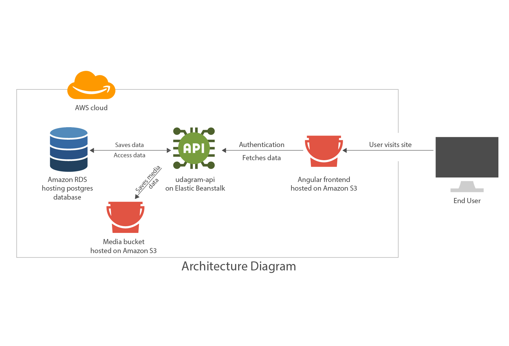

# Infrastructure Description  

## S3 Bucket (frontend)
The end user begins the process by visiting the frontend application hosted on an s3 bucket. This frontend calls the udagram-api

## Elastic Beanstalk
The api is run on elastic beanstalk and recieves request from the client (frontend) and run actions. The api is connected to a postgres database and uses it to store data. 

## S3 Bucket (media)
The api also uses a separate s3 bucket to store media files only (i.e, uploaded images).

## Amazon RDS
This is where the postgres database is hosted.