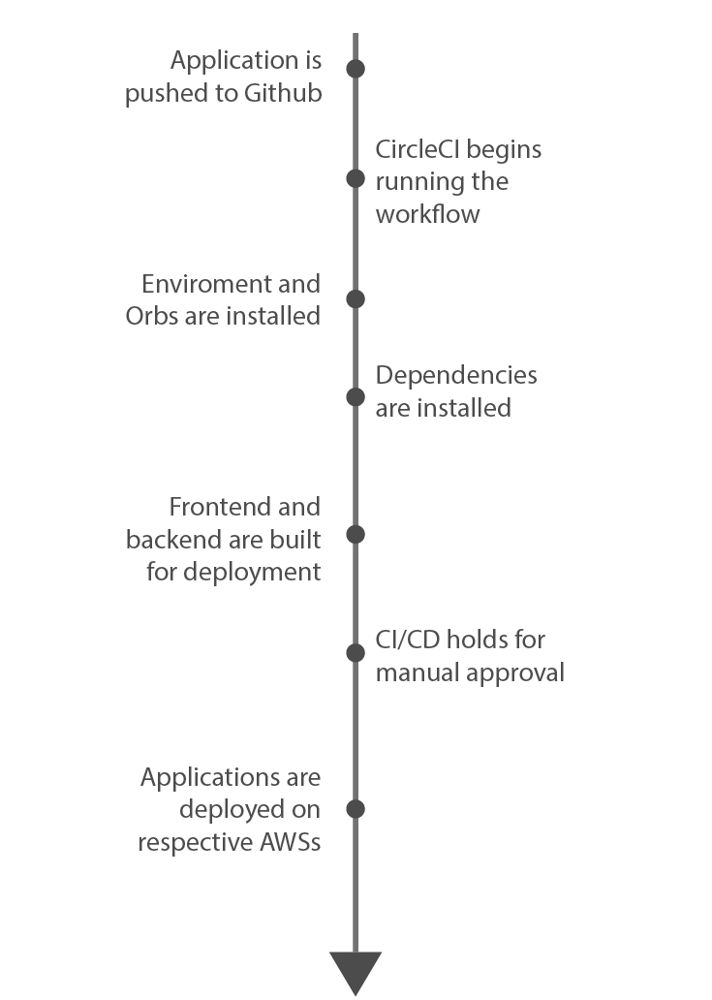

## Pipeline process
This is an overview of the steps that are taken by CircleCI, the CI/CD platform used for this project.  
On every push to the online repository the CircleCI platform perfoms the following steps:

## Flow
1. The pipeline installs the orbs required for hosting the application: node, eb, aws-cli
2. The pipelines starts with the first job: installs the node.js version required for the application.
3. The dependecies required for the frontend and backend are installed.
4. The code is linted and the frontend and api build versions are generated.
5. A hold step is used to await approval
6. After approval the orbs are setup and the deploy command is ran.